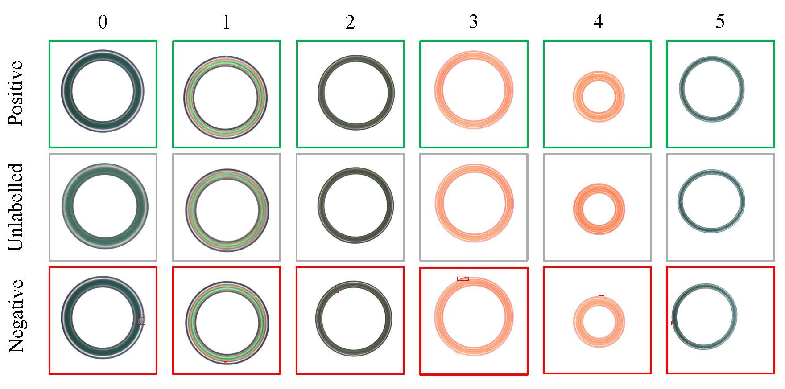

# CODED: A Dataset for Positive Unlabeled Learning in Circular Workpiece Defect Detection

The CODED dataset is a circular workpiece defect detection dataset for positive unlabeled learning. It comprises 7,594 high-resolution circular images collected from *six* different production lines. The data details and some examples of CODED are shown in the following table and figure.
The CODED dataset can also be downloaded from this link: [CODED](https://drive.google.com/file/d/1kj90dpOZxY0SiuWcv4qjX8eCHuvxXQIc/view?usp=sharing)

## Data Description

### Data Detials

|Name   |Resolution           |Train_Positive |Train_Unlabeled|Test_Positive|Test_Negative|Total    |#Defect types|
|---    |---                  |---            |---            |---          |---          |---      |---          |
|0      |1824 $\times$ 1824   |2,100          |2,368          |17           |250          |4,735    |2            |
|1      |2464 $\times$ 2056   |80             |79             |15           |117          |291      |3            |
|2      |2464 $\times$ 2056   |500            |489            |10           |462          |1,461    |12           |
|3      |2464 $\times$ 2056   |40             |41             |10           |82           |173      |7            |
|4      |2464 $\times$ 2056   |150            |150            |13           |346          |659      |5            |
|5      |2464 $\times$ 2056   |40             |40             |16           |179          |275      |4            |
|All    |2065 $\times$ 1911   |2,910          |3,167          |81           |1,436        |7,594    |33           |

### Data examples
Our CODED dataset contains image data of circular workpieces from six production lines, i.e., 0, 1, 2, 3, 4, and 5. Positive, unmarked, and negative samples are indicated by green, gray, and red edges, respectively.
  

### Dataset File Structure

    Data:  
    └─CODED  
        ├─0  
        │  ├─annotations  
        │  │  └─ng  
        │  │          xxx.json  
        │  │          ...  
        │  │          
        │  ├─test  
        │  │  ├─good  
        │  │  │      xxx.jpg  
        │  │  │      ...  
        │  │  │      
        │  │  └─ng  
        │  │          xxx.jpg  
        │  │          ...  
        │  │          
        │  └─train  
        │      ├─good  
        │      │      xxx.jpg  
        │      │      ...  
        │      │      
        │      └─unlabelled  
        │              xxx.jpg  
        │              ...  
        │              
        ├─...  

## Requirements
* Python 3.8
* Pytorch 1.10.1
* torchvision 0.11.2
* CUDA 11.1

Please refer to [`requirements.txt`](https://github.com/Hao-Chen-NJUST/CODED/blob/master/requirements.txt) and [`requirements_conda.txt`](https://github.com/Hao-Chen-NJUST/CODED/blob/master/requirements_conda.txt) for specific environment requirements.

## Quick Start
The complete CODED dataset and related code are included in this project, without additional download.

### Train

We train our model in one Nvidia RTX 3060 12GB card, and the training command is:

    python run.py
    
### Test

Our test command is:

    python run_test.py
